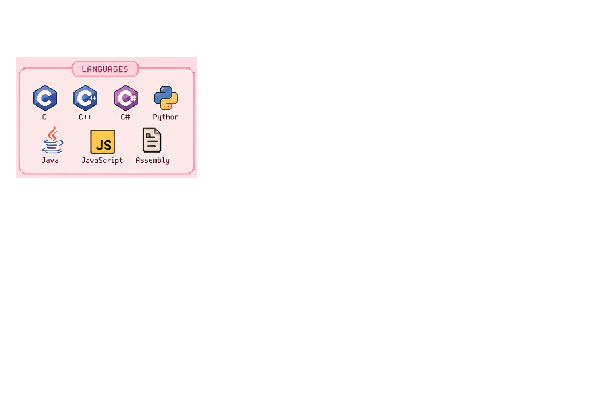
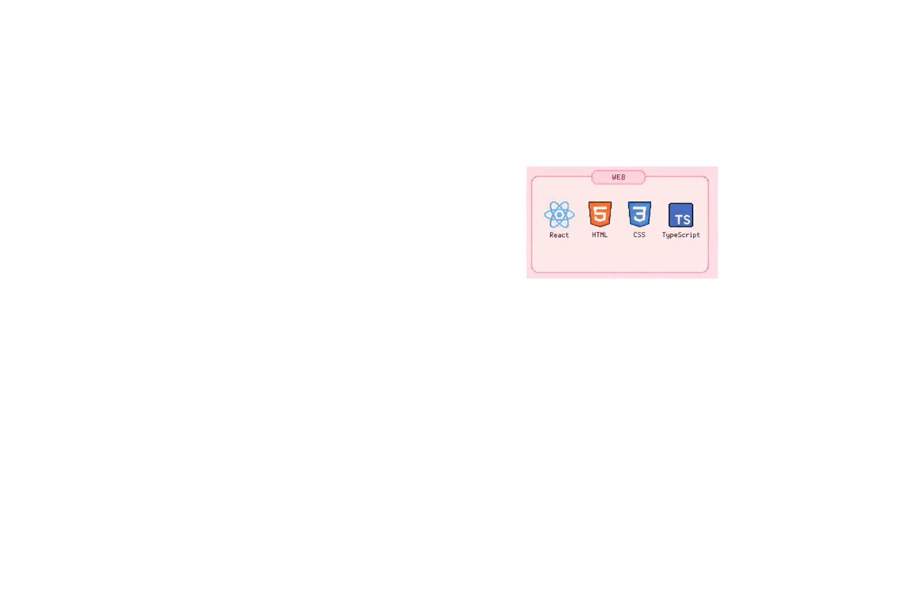
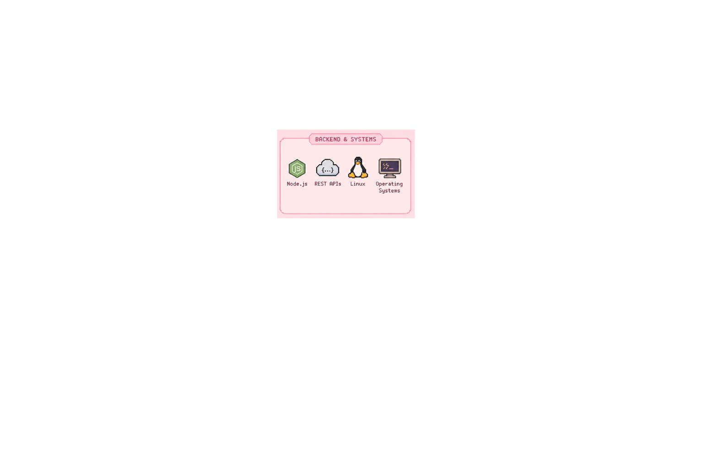
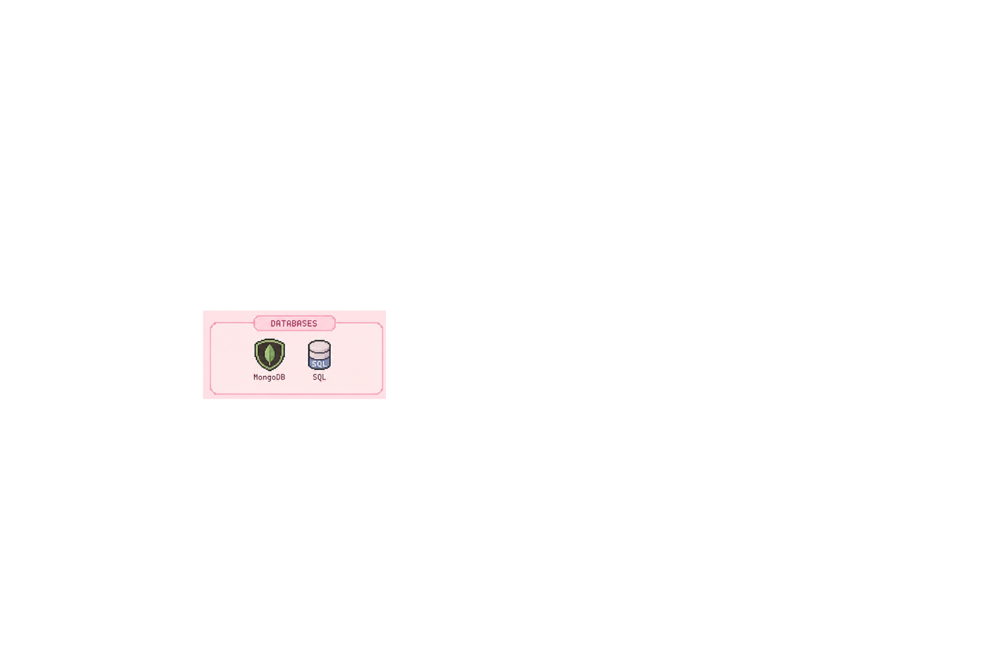
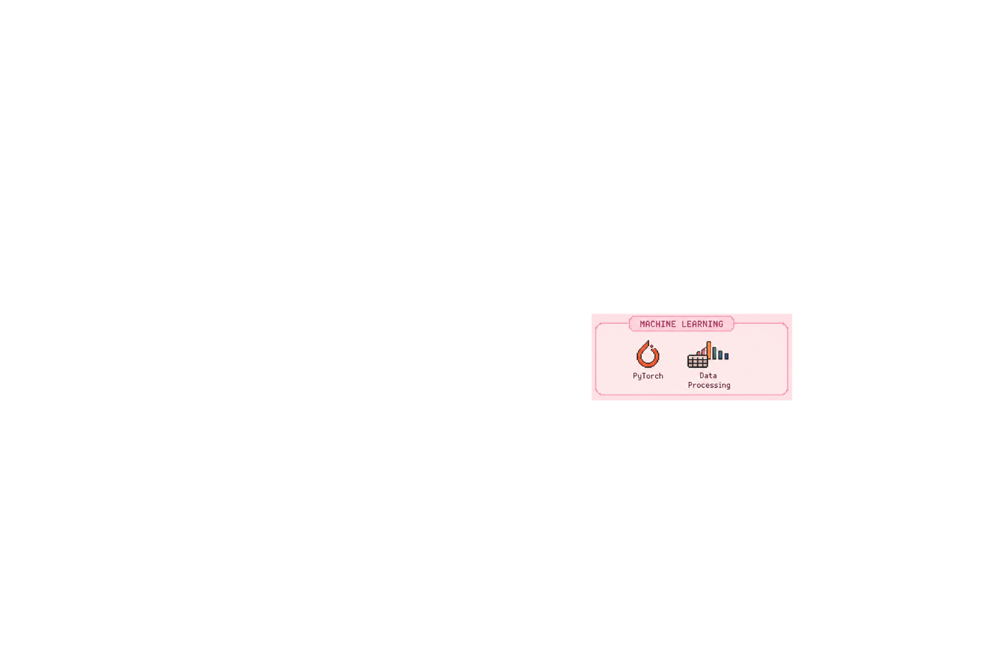
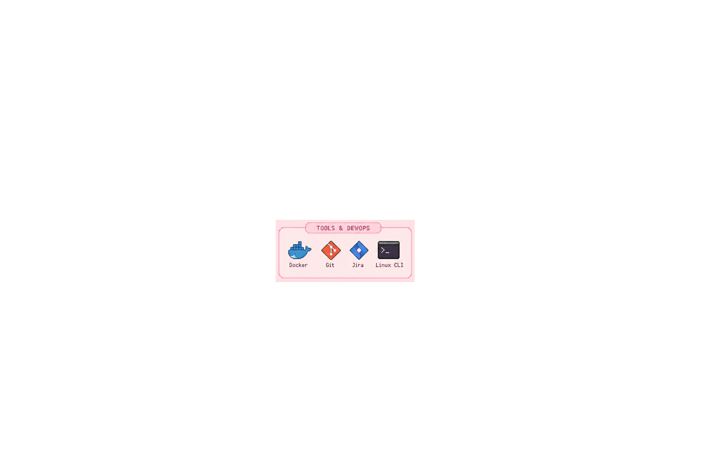

<h1>
   Hey, I'm Ofir 
</h1>
<h3>Welcome to my GitHub, feel free to explore my projects :)</h3>

<a href="mailto:ofir1410@gmail.com">ofir1410@gmail.com</a>
&nbsp;•&nbsp;

<a href="https://www.linkedin.com/in/ofir-menda/">LinkedIn</a>

---

<h2> About Me</h2>

I'm 25 years old and a third-year Computer Science student.  
I enjoy building projects that help me understand how things work and create real value.  
I'm especially interested in **systems, backend development, and real-world problem solving**.  

Currently looking for a **Software Engineering position**.

---

<h2> Projects</h2>

  
  &nbsp;
  
  &nbsp;
  
  &nbsp;
  
  &nbsp;
  

---

<h2> Skills</h2>

<table align="center">
  <tr>
    <td></td>
    <td></td>
  </tr>
  <tr>
    <td></td>
    <td></td>
  </tr>
  <tr>
    <td></td>
    <td></td>
  </tr>
  <tr>
    <td></td>
    <td></td>
  </tr>
</table>

---

✨ thanks for visiting ✨

