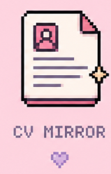

<h1>
   Hey, I'm Ofir 
</h1>
<h3>Welcome to my GitHub, feel free to explore my projects :)</h3>

<a href="mailto:ofir1410@gmail.com">ofir1410@gmail.com</a>
&nbsp;&nbsp;

<a href="https://www.linkedin.com/in/ofir-menda/">LinkedIn</a>

---

<h2> About Me</h2>

I'm 25 years old and a third-year Computer Science student.  
I enjoy building projects that help me understand how things work and create real value.    

Currently looking for a **Software Engineering position**.

---

<h2> Projects- you can click it! </h2>

  
  &nbsp;
  
  &nbsp;
  
  &nbsp;
  
  &nbsp;
  <a href="https://github.com/ofirmenda/uply">
     
  </a>

